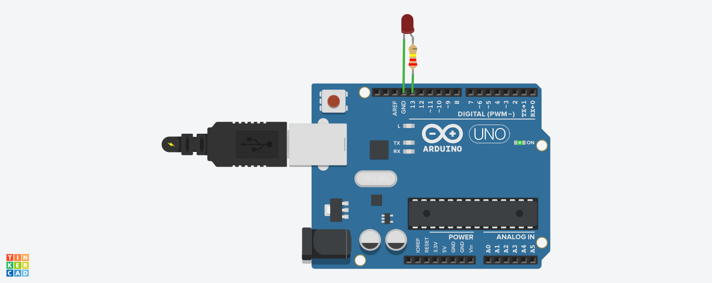

# LED Blinking Project (Arduino)

## 📖 Description
This project demonstrates a basic LED blinking circuit using Arduino Uno. It helps beginners understand digital output and timing using the delay() function.

## 🔧 Components Used
- Arduino Uno  
- LED  
- Resistor (220 ohm)  
- Breadboard  

## ⚙️ Working
The LED connected to pin 13 blinks every 1 second.

## 📸 Circuit Diagram

## 💻 Language Used
- Arduino (C/C++)

## 📌 Author
Durgesh Savale
